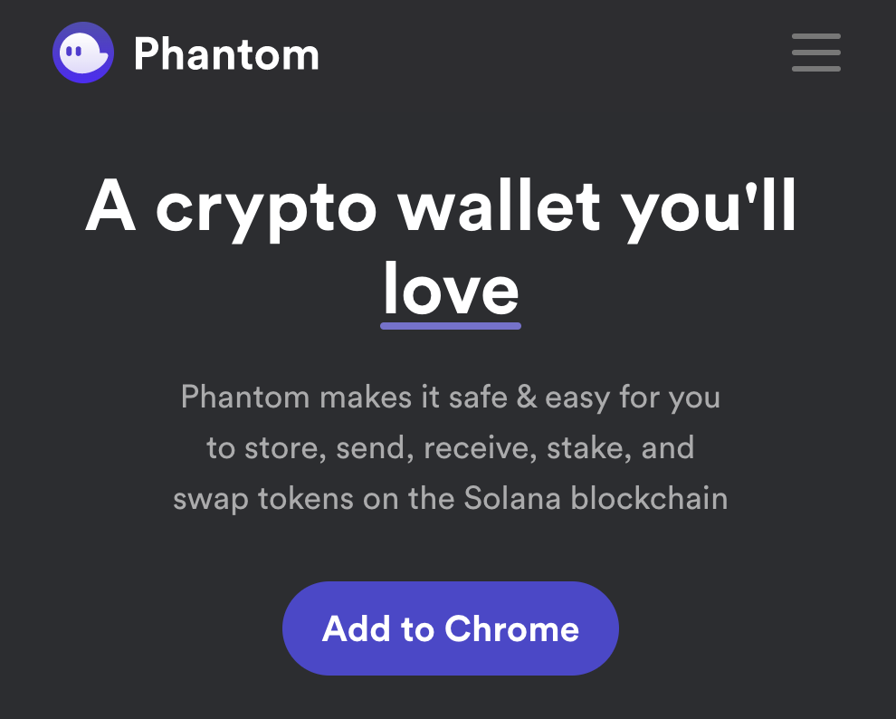
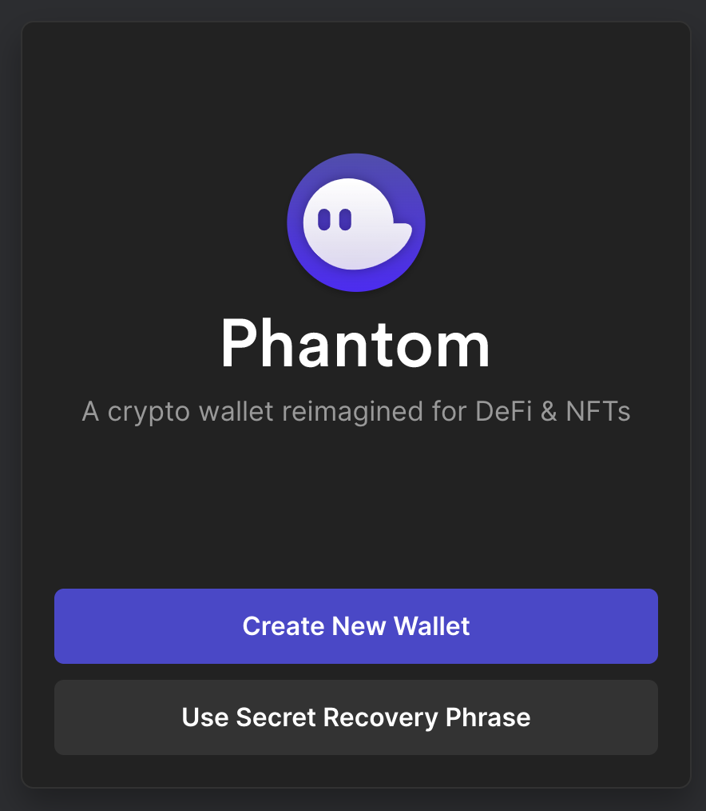
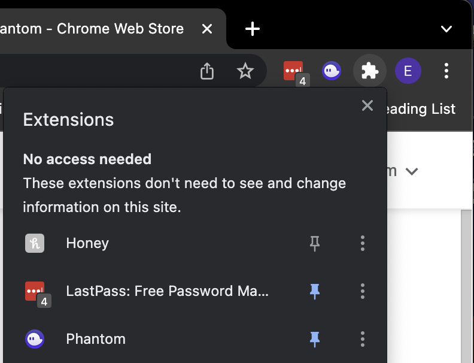
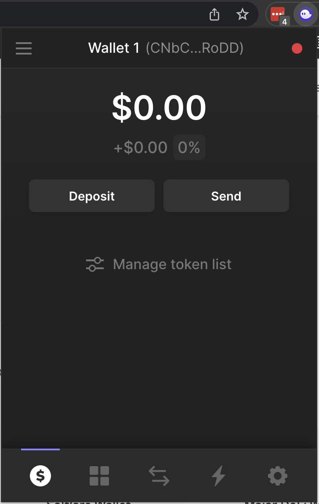

# Customer Setup Instructions
Please set up a Phantom wallet and send me your **PUBLIC KEY**. Here are instructions on how to obtain your public key on Chrome:

## Set Up Phantom & Obtain Your Public Key
1. Go to https://phantom.app/
1. Click "Add to Chrome"  
1. Click "Add to Chrome" if you are redirected to the Chrome Web Store
1. Confirm that you want to add the extension
1. When you are redirected to the Phantom home page click "Create New Wallet"  
1. Save your secret recovery phrase - DO NOT SHARE THIS WITH ANYONE
1. Create and save your password to unlock your wallet - DO NOT SHARE THIS WITH ANYONE
1. Click through the remaining prompts to complete the setup process
1. Pin the Phantom extension to Chrome by clicking the puzzle piece icon in the upper right corner of your browser    
1. Click Phantom's thumbtack icon to pin Phantom to Chrome  
1. Copy your public key by opening the Phantom plugin and clicking the string of characters to the right of "Wallet 1"  

## What's Next
Send an email to cryptofromapro@gmail.com and send me the following:
1. Your name
1. Your Phantom wallet's public key
1. Your token's desired image
1. Your token's desired name
1. Your token's desired ticker name
1. How many tokens you want (ie ten billion)
