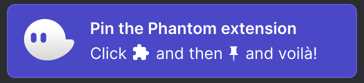

# Customer Setup Instructions
Please set up a Phantom wallet to receive your SPL tokens and send me your **PUBLIC KEY**. Here are instructions on how to obtain your public key on Chrome:

## Set Up Phantom & Obtain Your Public Key
1. Go to https://phantom.app/
1. Click "Add to Chrome"  
1. Click "Add to Chrome" if you are redirected to the Chrome Web Store
1. Confirm that you want to add the extension
1. When you are redirected to the Phantom home page click "Create New Wallet"  
1. Save your secret recovery phrase - DO NOT SHARE THIS WITH ANYONE
1. Create and save your password to unlock your wallet - DO NOT SHARE THIS WITH ANYONE
1. Click through the remaining prompts to complete the setup process
1. Pin the Phantom extension to Chrome by clicking the puzzle piece icon in the upper right corner of your browser    
1. Click Phantom's thumbtack icon to pin Phantom to Chrome  
1. Copy your public key by opening the Phantom plugin and clicking the string of characters to the right of "Wallet 1"  

## What's Next
1. Send an email to cryptofromapro@gmail.com and include the following for your token:
   1. Your name
   1. Your Phantom wallet's public key (ie: CNbCFr99JtaqQuZT1eVWgbxo5cGsLzij27vWQvxwRoDD)
   1. An image for your token 
   1. A name for your token (ie: Class Participation Coin)
   1. A ticker name for your token (ie: CPC)
   1. How many tokens you want to be created (Max: 18,000,000,000)
1. Include your Venmo username at the bottom of the email
1. Token names and token ticker names must be unique on the Solana blockchain so if there are any issues with uniqueness I will email you. Otherwise you will receive a Venmo request from the account @CryptoFromAPro.
1. Once the payment is complete, it will take at minimum 1 week to mint your tokens.
1. I will send you a followup email when your tokens are ready to be sent to your wallet's public address.
1. Feel free email cryptofromapro@gmail.com with any questions or concerns. I check my account daily!

Thank you very much!
